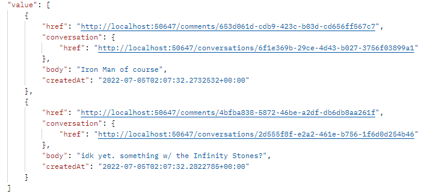
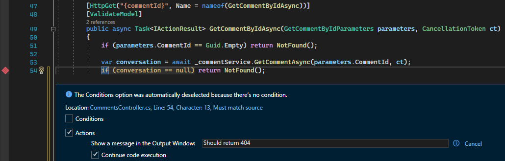
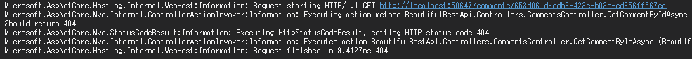
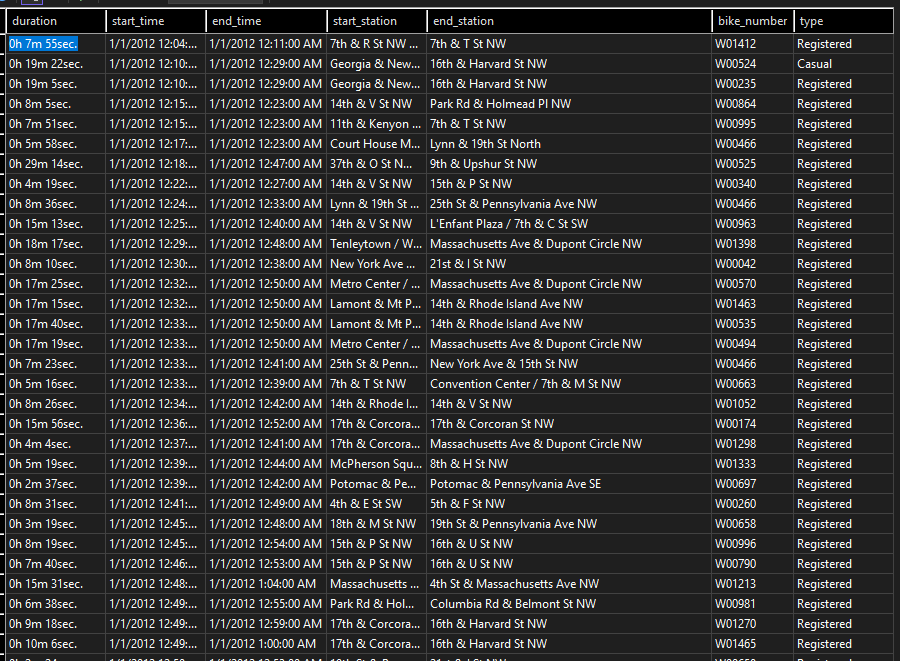
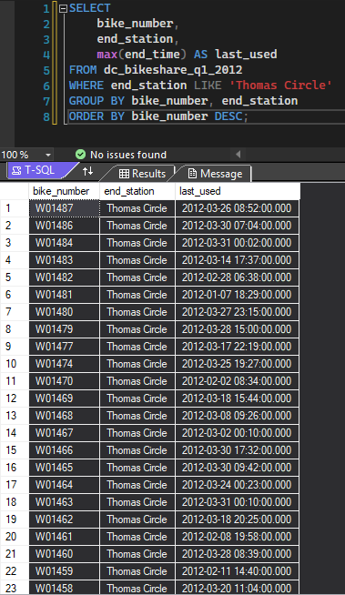

### Sample Code-style writeup for MD application

#### C# WebAPI build and QA
Code borrowed from: https://github.com/nbarbettini/BeautifulRestApi

After cloning, building, and running project using Visual Studio, let's send a `GET` request on `http://localhost:50647/comments` via Postman.
Accessing this endpoint allows us to see all (2) of the comments in the sample data.



Now, let's look at the Comments `Controller` at `src/Controllers/CommentsController.cs`. There's no actual bug here, but let's put a breakpoint at line 54. You can do so by right-clicking on the light gray margin on the left or with `F9`. Under Actions, we'll put a message to be displayed in the Output Window and check "Continue code execution."


Back in Postman, copy the ID value from one of the comments. Change the value, but keep it in the same format so it remains a valid input. Make a `GET` request with the new value. We're asking the API to look for a comment ID that doesn't exist. We should have a way to handle errors like this.

There's no bug in this example, but if an error were not being handled gracefully, breakpoints are helpful in pinpointing issues. A clearer example of debugging might be tracing a variable. For instance, seeing whether the value is what you would expect at a given point in the code.

The breakpoint applies before the line it's on executes. In the output, you can see the "Should return 404" message before NotFound() is returned.


#### Stored Procedure in SQL
This [dataset](https://data.world/sya/capital-bikeshare-trip-data) consists of roughly 360,000 trips from a bikeshare program.


For a sample query, let's find how many bikes are at a given station and not in use. We only need the bike numbers in our output, but I will include the last time each bike was used and the end station to check for errors.
Since the bikes could have been used multiple times during this period, we need to select only the most recent end time for each bike.
```tsql
SELECT
    bike_number,
    end_station,
    max(end_time) AS last_used
FROM dc_bikeshare_q1_2012
WHERE end_station LIKE 'Thomas Circle'
GROUP BY bike_number, end_station
ORDER BY bike_number DESC;
```

First, we specify the columns we want to select. We can use the `max()` function on the same line to find the most recent `end_time`. For clarity, we'll give this column an alias in the temporary table that will be produced by this query. The next line specifies the table to be used. The `WHERE` clause is our filtering logic. Lastly, group and sort by bike number.



After executing the query, we see that it returns 1,266 rows, all with the specified end station and without repeating bike numbers.

Now, let's pretend that the bikes are chairs and the station is a warehouse. A client might want to know how many chairs are at a given warehouse on a regular basis. We can create a stored procedure to save time instead of re-writing code for commonly-used logic.

To get the count, we can nest the query in a COUNT(*) query, remembering to give an alias to the table in the subquery. The ORDER BY statement is no longer needed.
```tsql
SELECT COUNT(*) FROM
(SELECT
    bike_number,
    end_station,
    max(end_time) AS last_used
FROM dc_bikeshare_q1_2012
WHERE end_station LIKE 'Thomas Circle'
GROUP BY bike_number, end_station) temp;
```

To create the stored procedure:
```tsql
CREATE PROCEDURE AvailableBikes @station nvarchar(100)
AS
SELECT COUNT(*) FROM
(SELECT
    bike_number,
    end_station,
    max(end_time) AS last_used
FROM dc_bikeshare_q1_2012
WHERE end_station = @station
GROUP BY bike_number, end_station) temp;
GO
```

Execute the query, then refresh the Stored Procedures folder in Server Explorer. The stored procedure should be there, meaning we can execute it at any point in the future. Just call the procedure name and pass any necessary `parameters`. In this case, the station name.
```tsql
EXEC AvailableBikes @station = N'Thomas Circle';
GO
```
And we get the same result, 1,266 bikes.
